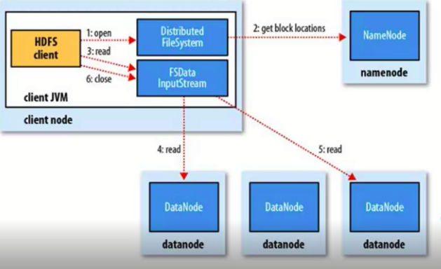
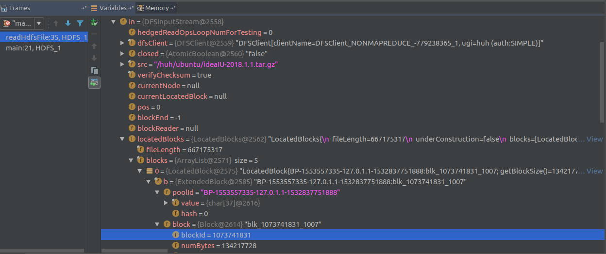
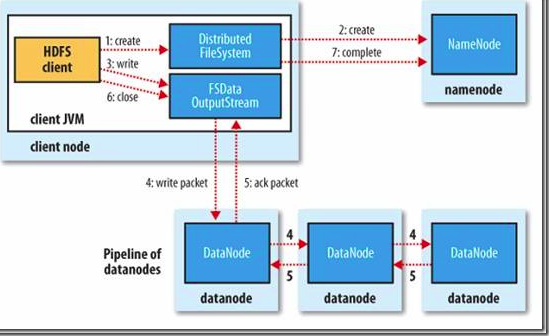
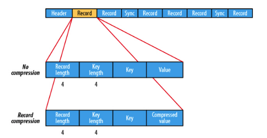
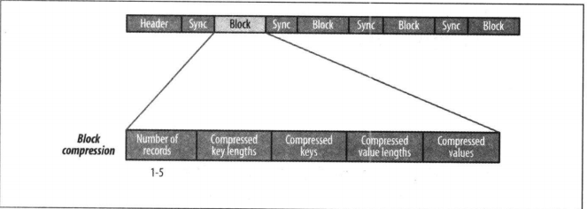

# 第一部分 HDFS
## １.命名空间镜像文件、编辑日志文件
* 维护文件系统树信息，包括目录和文件信息, 这些信息以文件形式永久保存在磁盘;
* 块的信息会在Datanode重启时重建，并非永久保存。

## 2.NameNode　容错方式
* 方式一: 将namenode元数据备份到其他文件系统，如: NFS. 针对DN的操作将被实时、原子地保存到其他文件系统。 可通过 属性: `dfs.namenode.name.dir` 配置。
* 方式二: 在另一台机器上运行一个NameNode的备份 ==> SecondNameNode， 用以定期合并镜像文件和编辑日志，减少NN的启动时间。 但其状态会稍微落后于NN, 会有部分数据丢失。可以考虑将方式一中在NFS上的元数据复制到SecondNameNode上来解决数据丢失问题。
* 方式三: HA
> 注： 前两种方式依然存在Single Point Of Failure(单点故障)

## 3.联邦HDFS
命名空间卷(由元数据和数据块池组成)。 联邦HDFS允许扩展多个NameNode， 每个NameNode管理文件系统命名空间的一部分。由：ViewFileSystem和viewfs://URI进行配置。datanode像每个namenode注册，并参与维护多个数据块池中的数据块。

## 4. QUM(Quorum Journal Manager, 群体日志管理器)

## 5 使用HTTP接口,访问HDFS(WebHdfsFileSystem)
* 缺点: 速度慢，不适合大文件
* 方式: client直接访问HDFS; 或client通过代理访问HDFS; 二者都是使用`WebHDFS协议`
* 改进: 推荐使用java 原生接口。

## 6. HDFS类分析
`FileSystem`
`DistributedFileSystem`
`LocalFileSystem`
`Configuration`
`Path`
`URI`
`FSDataInputStream`
`FSDataOutputStream`
`FileUtils`
`DataStreamer`

## 7. 文件匹配
* `FileSystem.globStatus(PathPattern , PathFilter)` // 返回符合pattern条件的路径组成的FileStatus数组， PathFilter 用于进一步过滤。
usage:
```
for(FileStatus f: fileSystem.globStatus(new Path("/*/ubuntu/*"))){
    System.out.println(f.getPath());
}
```

* `FileUtil.stat2Paths(FileStatus[])` // 将FileStatus数组转为Path数组


## 8. HDFS 读文件剖析
0. HDFS读流程图

    

    					 	(this image comes from Hadoop: The Definitive Guide)

1. `HDFS Client`的调用`DistributedFileSystem.open(file_path)`, 通过RPC(远程过程调用)与`NameNode`交互并返回file_path的在DataNode的块信息给`HDFS Client`，(客户端和DataNode之间是`TCP连接`, 该连接由客户端发起）．得到一个DataInputStream字节流对象;

2. 该对象FSDataInputStream <br />

   
```[fsDataInputStream对象的
in-->
    locatedBlocks(所有块)|lastLocatedBlock(最后一个块)-->
      blocks(ArrayList, 保存该文件的每个块的信息， 其大小为块的个数)-->  
        block序号-->
          poolId(块ip地址，存在于一个名为`value`的字符数组中; DN的ip地址、hostname、机架、DN的UUID等)|block(offset等。见下一级信息)-->
              block_id(块ID)|numBates(块大小)]
```
综上, NameNode返回的 `Block Info` 都封装在fs.open()方法返回的`FSDataInputStream流对象`里， 该对象对文件的一个块可从网络拓扑最近的`DataNode` 反复执行read()方法;

3. 当到达块尾时关闭与该块的连接，并继续从下一个块读取。块的读取顺序是按照`DataNode`与流(DataInputStream)的连接顺序读取的;

4. 当读取到最后一个块， 调用close()关闭流。

注1: 在上述过程中， 若与DataNode发生通信故障，将从临近的DataNode再读取块，并报告给NameNode，减少从该DataNode读取的次数；

注2: 发现损坏的块也将报告给NameNode

注3: 这种设计的优点在于数据并不经过NameNode,减少其负担。其次时块的元数据保存在NN的内存中，因而读取更加高效。

注４: 短回路本地读(short-cricuit local read)，即: 客户端和数据块位于同一节点,这种读取方式直接从磁盘读取，　绕过网络传输，能使诸如HBase的性能更高．启用"短回路本地度"　==> `dfs.client.read.shortcircuit`设置为true.

## 9. HDFS写文件剖析

0. 流程图:

    

    					 	(this image comes from Hadoop: The Definitive Guide)

1. HDFS Client调用 `DistributedFileSystem.create()`方法，与`NameNode`创建一个RPC调用，NN检查文件是否存在及当前请求用户是否拥有权限新建文件。检查失败抛出IO异常; 检查通过则 `NN`返回一个`FSDataOutputStream`对象， 辅助与NN、DN之间的通信;

2. `FSDataOutputStream`对象将文件拆分成数据包， 放入`dataQueue`(其实是一个LinkedList);

   

3. `FSDataOutputStream`对象中的`dataStreamer`负责挑选出合适的`DN`组成DataNode pipeline, 通知`NN`分配数据块， 然后`dataStreamer`将数据包流式传输到datanode pipeline 的`第一个DataNode`。

4. 当第一DataNode完成数据包存储，该DataNode将数据包发送到第二个DataNode， 依次类推。DistributedFileSystem对象维护的`ackQueue`(也是一个LinkedList)在收到所有datanode的确认信息后将删除。最后调用流的close()[隐含调用hflush()方法]， 将剩余的数据包写入datanode pipeline.

注1: DataNode写入数据包期间故障。

* 首先`关闭`DataNode Pipeline； <br />
* 然后数据包会被添加到`dataQueue`的最前端来保证数据不丢失；
* 正常的DataNode的该数据块将被标识，并发送标识信息给`NN`, `NN`之后会进行块检查，发现块的副本数不够，并在新的节点新建该块的副本。
* 从`DataNode PipeLine`中删除损坏的DN,剩下的DN组成`新的DataNode PipeLine`并继续写入数据包。 `NN`之后会进行块检查，发现块的副本数不够，并在新的节点新建该块的副本。

## 10. HDFS的块存放策略(dfs.replication = 3)
* 第一个块: 客户端节点(若客户端节点运行在集群外，将随机挑选一个不满不忙的节点)
* 第二个块: 第一个节点机架之外， 随机挑选一个节点；
* 第三个块: 第二个节点同一机架，随机挑一个其他节点。

## 11. 一致性模型
** 定义: 描述文件系统文件读写数据的可见性。

** 问题:  <br/>
当新建一个文件， 在文件系统的命名空间是立即可见的，但是文件的内容并非对所有的reader立即可见，只有当前reader可见。

** 解决:  <br/>
 `DistributedFileSystem`提供`hflush()`方法，将缓存刷新到`DataNode内存中`，当该方法执行完毕，保证目前所有写入的数据达到`DataNode PipeLine`中所有DataNode`内存`中，并对所有reader可见。该方法存在DN断电时数据丢失的风险;

 `DistributedFileSystem提供`提供`hsync()`方法， 将数据写入`硬盘`， 并对所有reader可见。但成本较高。

 # 第二部分 Hadoop I/O
 ## 1. Hadoop 中的文件一致性
** 注意: 每个checksum=32bit=4字节 **

| 选项 | 介绍 |
|:-----|:----|
| 原理  |  `CRC 32`,即循环冗余校验，在文件写入时计算出校验码，在文件读取时再次计算校验码，然后对比校验码是否一致。|
| 注意  |   校验码同样是写到磁盘，也存在错误可能，只是概率极小。 |
| 在Hadoop上的应用 |  Hadoop使用 `ChecksunFileSystem`(实现了CRC-32); <br />HDFS使用`CRC-32C`（CRC-32的进阶高效版）|
| dfs.bytes-per-checksum | 设置每隔多少字节，计算一次checksum. 默认:`512` |

## 2. Hadoop 如何保证文件一致性(损坏检测)
* HDFS会在文件存储时计算校验和，并在文件读取时检验校验和；

* 客户端写入文件或者从DataNode上拷贝文件时，DataNode Pipeline的最后一个节点符合检验校验和，发现不一致时，将抛出`ChecksumException`, 这时编程人员应当重试写入操作；

* 客户端读取文件检测到错误，将发生错误的数据块报告给NN, NN将此数据块标记， 此时抛出ChecksumException时。之后此数据块的一个复本将复制一个数据块到一台DN,并删除发生错误的数据块；

* 每个DN会在后台维护一个`DataBlockScanner`, 定时检查此DN上的数据块。
注: 若读取时不需要检查校验和，只需fs.setVerifyChechsum(false); 使用cp、copyToLocal等命令时也可指定禁用`checksum`(-ignoreCrc).
注: hadoop fs -checksum /file_path   // 查看文件校验和

## 3. 压缩

* DEFLATE算法: <br />
Hadoop支持的压缩算法分类(`实测版本:hadoop-2.7.2`)
default算法将文件压缩成多个压缩块，块与块之间无任何标记，故文件在mapreduce时``无法被切片``，因此只能由一个map的处理一个Deflate压缩文件的所有块， 计算节点的本地优势丢失。

* 压缩算法分类介绍： <br />

| 压缩算法 | 工具  | 算法 | 文件扩展名 | 是否可切分 | 原生hadoop支持 | 压缩速率 | 解压速率 |
|:--------|:--------|:--------|:--------|:--------|:--------|:--------|:--------|
| Deflate | 无 |deflate | .deflate | 否 | 有 |
| gzip    | gzip |deflate | .gz  | 否  | 有 |
| bzip2   | bzip2 | bzip2  | .bz2 | 是 | 有 |
| LZO     | lzop | LZO    | .lzo   | 否(索引后可切片) | 无本地库|
| LZ4     | 无 | LZ4    |  .lz4   | 否 | 无本地库 |
| Snappy  | 无 | Snappy | .snappy | 否 |无本地库，需要单独编译hadoop |

** 注: MapReduce 可以在读取文件后根据文件后缀名识别文件的压缩方式并自动解压。 **

** 一点优化思路(优先级: 1 > 2 > 3 > 4) **
1. 使用容器文件格式: 如: SequenceFile、Avro、Parquet、ORCFiles, 此三者均支持压缩和切分。 配合上述文件格式，再结合压缩工具共同使用；
2. 使用支持切分的压缩格式如: bzip、LZO(文件需要先索引);
3. 这种思路有点意思。。。，在压缩一个文件存储之前，先`在应用中将文件切片成块`，再就可以选择任意的压缩格式压缩、存储。<b> 需要注意的是，原始文件要切分成合适的块大小，以保证压缩后每个块的大小不会超过HDFS的文件块大小。<b />
4. 存储不经压缩的文件。

## 4. 序列化(Writable)
[不知道该该于哪一类，暂时放在HDFS中吧]

4.1 Hadoop使用序列化的原因？ <br />
多个节点进程间通信使用RPC, RPC将消息`序列化`成字节流传输， 接收消息的节点将字节流`反序列化`成原始消息。

4.2 概念
1. 序列化: 将结构化对象转化为字节流，以便网络传输、永久存储；
2. 反序列化: 将字节流转化为对象。

4.3 Hadoop的实现 ---- <b> org.apache.hadoop.io.Writable接口 </b>

4.4 其他序列化的实现 ---- AVRO, Protobuf

## 5. 基于文件的数据结构
### 5.1 SequenceFile
5.1.1 何为SequenceFile ? <br />
Hadoop为存储[key, value]形式的二进制文件而设计的一种数据结构

5.1.2 SequenceFile的特点 ?
* 可切片,作为MR的输入分片;
* 支持压缩 (CompressionType.NONE, RECORD, BLOCK);
* 每一行都是一个key value对;
* 可以设置同步点 (sync point), 支持从指定position的下一个`同步点`读取;
* 小文件的容器, 提高HDFS和MR的效率;
* Key和Value可以是任意类型Writable或者是自定义Writable.

5.1.3 CompressionType





​					(this two images come from Hadoop: The Definitive Guide)

|CompressionType | 字段组成||||||||
|:-----|:-----:|:-----:|:-----:|:-----:|:-----:|:-----:|:-----:|
|NONE| HEADER|RECORD|RECORD|SYNC|RECORD|RECORD|SYNC|...|
|RECORD| 同上 ||||||||
|BLOCK| HEADER | SYNC|BLOCK |SYNC|BLOCK||...||

* CompressionType为`NONE`, `RECODE字段`详解:
|record_length|key_length|key|value|

* CompressionType为`RECORD`, `RECORD字段`详解:
|record_length | key_length | key | compressed_value |

* CompressionType为`BLOCK`, `BLOCK字段`详解:
|num_of_records| compressed_key_length| compressed_keys |compressed_value_length | compressed_values |

注: 前两者的key未压缩, 后者的key被压缩

5.1.4 创建SequenceFile.  <br />
通过`SequenceFile.createWriter()`获得一个`writer`, 再调用其`append()`方法创建文件或在文件后追加.

usage:
```
public static void createSeqFile(String filePath, Configuration conf, FileSystem fs) {
        Path path = new Path(filePath);
        SequenceFile.Writer writer = null;
        IntWritable key = new IntWritable();
        Text value = new Text();
        final String[] DATA = {"hello", "you are the apple of my eye", "风味酸牛奶", "Intellij IDEA Ultimate Edition", "Flavored Yoghurt"};
        try {
            Class clazz = Class.forName("org.apache.hadoop.io.compress.BZip2Codec");
            CompressionCodec codec = (CompressionCodec) ReflectionUtils.newInstance(clazz, conf);
            writer = SequenceFile.createWriter(fs, conf, path, key.getClass(), value.getClass(), SequenceFile.CompressionType.BLOCK, codec);
            for (int i = 0; i < DATA.length; i ++) {
                key.set(i);
                value.set(DATA[i]);
                writer.append(key, value);
            }
            writer.hflush();
            System.out.println("done!");
        } catch (Exception e) {
            e.printStackTrace();
        } finally {
            IOUtils.closeStream(writer);
        }
    }
```

5.1.5 读取SequenceFile

`获取SequenceFile.Reader的对象, 调用其`next()方法`, 将要获取的key和value作为next()的参数,反复调用next()方法. ** 若读取成功返回true, 读到文件尾返回false ** .<br />
usage:
```
public static void readSeqFile(String filePath, Configuration conf, FileSystem fs) {
        Path path = new Path(filePath);
        SequenceFile.Reader reader = null;
        try {
            reader = new SequenceFile.Reader(fs, path, conf);
            Writable key = (Writable) ReflectionUtils.newInstance(reader.getKeyClass(), conf);
            Writable value = (Writable) ReflectionUtils.newInstance(reader.getValueClass(), conf);
            while (reader.next(key, value)) {
                System.out.printf("%s\t%s\n", key, value);
            }
        } catch (Exception e) {
            e.printStackTrace();
        } finally {
            IOUtils.closeStream(reader);
        }
    }
```

### 5.2 MapFile
5.2.1 何为MapFile ?
5.2.2 MapFile的特点

## 6. 回收站

hadoop 文件系统中，通过`shell`和`Trash.moveToTrash()`方法删除的文件并未被真正删除，而是转移到回收站(一个特定的文件夹)中保留一段时间，超过该时间(core-site.xml 中fs.trash.interval属性来控制回收站文件保存时间)才被永久删除．

1. 回收站位置: 当回收站被启用，在每个用户`home`目录下，都有一个`.Trash`目录即: 回收站．
2. 文件恢复: 将想要恢复的文件从`.Trash`目录中移出即可．
3. 文件删除: 对于HDFS，会自动删除回收站内的达到时长的文件，对于其他文件系统，需要`$ hadoop fs`-expunge 手动删除或`Trash.expunge()来删除`


