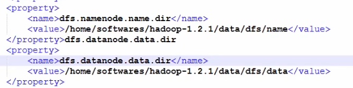
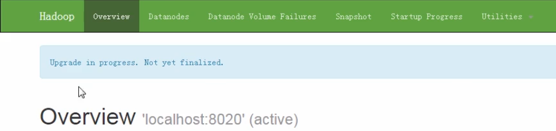

# Hadoop 集群构建过程的一些小问题

##  1. 硬件

### 1.1  ECC  RAM 

[Error Checking and Correcting RAM](https://www.fasthosts.co.uk/blog/servers/ecc-ram-keeping-critical-data-error-free), 亦有称: Error-correcting code RAM. 使用被`奇偶校验`的方法不断扫描数据.

ECC RAM向每个字节添加一个额外的位，称为奇偶校验位。奇偶校验位将字节中的1s合计为偶数（0）或奇数（1）二进制数字。如果奇偶校验位不匹配先前为特定字节记录的，则ECC RAM知道发生了错误。然后，它可以使用复杂的代码来恢复原始的、未损坏的数据并纠正错误。其缺点, 一是成本高; 二是不可与非ECC RAM 组合使用．

## 2. 机架感知


0. 详见＜＜Hadoop权威指南＞＞page282．

1. 背景:　减少MR的跨数据中心, 机架数据传输带来的带宽压力，是一种计算集群内部不同节点之间距离的技术．

2. 查看机架: `$ hadoop dfsadmin -printTopology`　

3. 实现:　该功能默认关闭, 即: 所有节点默认位于一个｀/default-rack｀机架下． 要设置机架感知，用户需要自己编写脚本来定义节点的映射关系(rack字典)和配置conf/core-site.xml文件的属性来启动机架感知，并将二者都分发到集群每个节点．
    １). {HADOOP_CONF}/core-site.xml文件: 配置脚本(py或shell都行)文件的位置,
    ```
    <property>
        <name>topology.script.file.name</name>
        <value>/path/of/script</value>
    </property>
    ```

    2). 编写脚本[rack-aware.sh]: 
    ```
    #!/bin/bash  
    HADOOP_CONF=/soft/hadoop/etc/hadoop  
    while [ $# -gt 0 ] ; 
    do  
        nodeArg=$1  
        exec<${HADOOP_CONF}/topology.data  
        result=""  
        while read line
        do  
                ar=( $line )  
                if [ "${ar[0]}" = "$nodeArg" ]||[ "${ar[1]}" = "$nodeArg" ]
                then  
                        result="${ar[2]}"  
                fi  
        done  
        shift  
        if [ -z "$result" ]
        then  
                echo -n "/default-rack"  
        else  
                echo -n "$result"  
        fi  
    done
    ```
    3). 配置rack与节点的映射关系[topology.data]
    ```
    ip1	host1	/switch/rack1
    ip2	host2	/switch/rack1
    ip3 host3	/switch/rack1
    ip4 host4	/switch/rack2
    ip5 host5	/switch/rack2
    ip6 host6	/switch/rack2
    ```
    其中，`switch`代表交换机, `rack１，２代表机架`
    4).  将配置文件`core-site.xml, rack-aware.sh, topology.data`分发到集群每个节点;
    5)．启动．若新增DN, 只需将相关配置发生到DN节点, 启动该DN即可(无需重启NN).

## 3. 集群构建

以往错误纠正:`{HADOOP_CONF}/slaves `文件用于配置启动`DN`和`NM`的节点，该文件并不需要分发到每个DN或NM节点，只要保证`NN`节点有该文件即可．

### 3.1 为每个用户设置HDFS的`home`目录等及权限


### 3.2 配置文件单独存放
为便于后期升级和避免错误的配置导致集群宕机(<u>后者暂未理解到, 但是有老司机说这样确实有效</u>), 构建集群时并不将配置文件放在{HAOOOP_HOME}/etc/hadoop中, 而是单独存放于某处．
通过`--config`或者`HADOOP_CONF_DIR`环境变量来指定配置文件存放位置．

1). 通过指定配置文件位置启动

`$ start-all.sh --config /home/huh/Desktop/hadoop`

2). 修改了默认的配置文件位置后，执行hadoop 的其他命令可能会抛"配置找不到''异常．需要在命令后加上`--config`选项并指定配置文件所在的目录. 如下:

`$ hdfs --config /home/huh/Desktop/hadoop/ dfs -ls -R /`

同理，系统日志文件也应该单独存放，一般建议`/var/log/hadoop`, 在{HADOOP_CONF_DIR}/hadoop_env.sh文件中新增`export HADOOP_LOG_DIR=/var/log/hadoop`即可．

### 3.3 NameNode内存推荐配置

1000MB可管理百万个文件，每百万个数据块分配1000MB内存．

### 3.4 查看进程配置

方式１: `$ hdfs getconf -confKey prop`

方式２: `http://process_host_name:port/conf`  

usage: `http://localhost:50070/conf`

## 3.5 问题

```
-ls: java.net.UnknownHostException:huh-hadoop-ha-cluster
Usage: hadoop fs [generic options] -ls [-d] [-h] [-R] [<path> ...]
```

解决：[hdfs-site.xml]添加如下配置，重启集群

```
<property> 
<name>dfs.client.failover.proxy.provider.huh-hadoop-ha-cluster</name>
<value>org.apache.hadoop.hdfs.server.namenode.ha.ConfiguredFailoverProxyProvider</value>
</property>
```

## 3.6 升级hadoop

原理: 修改新版本的元数据信息指向，指向旧版本的元数据．

如下：　升级hadoop1.2.1到2.7.2



注意： 不可以使用格式化命令．直接停止旧集群，启动新版本集群即可．使用以下命令启动`NN`.然后查看web页面，等待升级完成．


