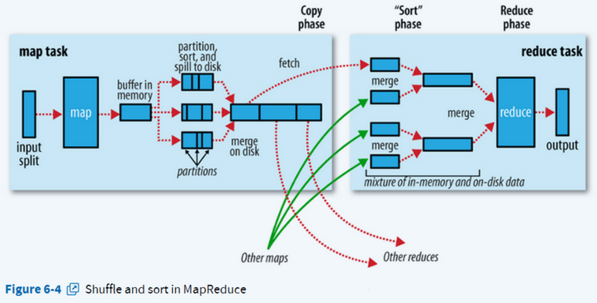
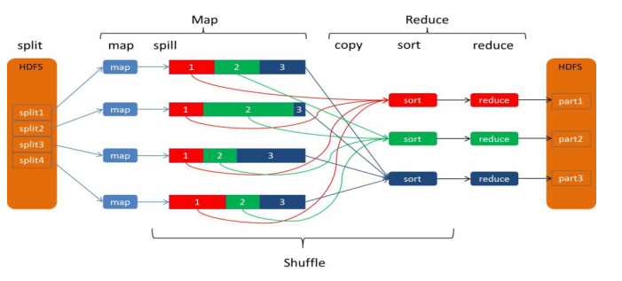
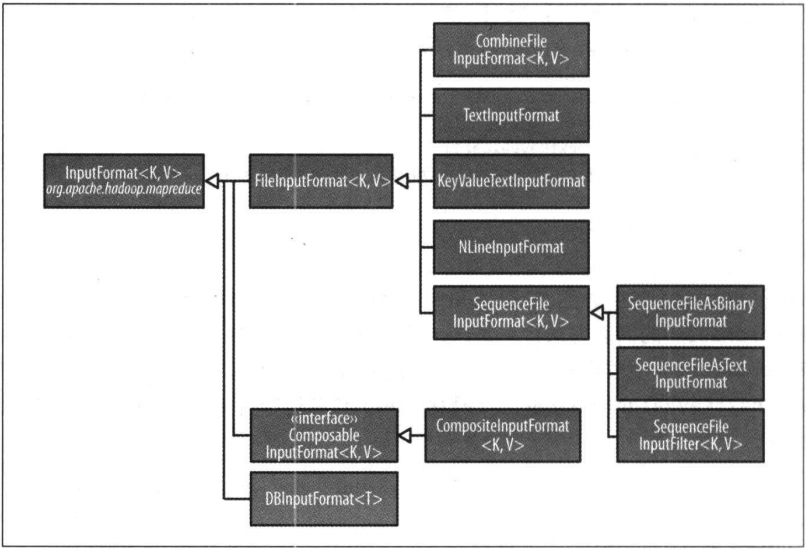
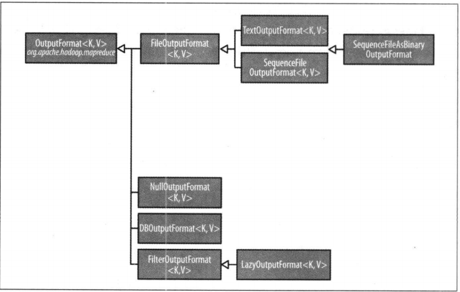

# MR
mapreduce作业在yarn上的端口: 8088

** 书籍推荐<<MapReduce数据密集型文本处理>> **

## 1. 环境配置值得注意的Point
1. 配置文件按顺序添加到Configuration, 若多个文件中存在同一属性, 则后来的配置文件中的属性会覆盖前面的属性.
2. 将`<final>true</final>`放在属性下边, 则该属性不会被后来的覆盖;
3. 集群站点应该防止客户的配置文件对线上集群的影响. 通常的做法是将线上集群的配置属性`加上`final(参考第2点).

## 2. 多个作业的执行顺序控制
1. 线性执行, 若job1中断, 则job2不会执行:
```
JobClient.runJob(conf1);
JobClient.runJob(conf2);
```

2. `org.apache.hadoop.mapreduce.jobcontrol.JobControl`类.
该类的实例表示一个作业运行图, 支持DIY作业间的依赖顺序配置, 一旦某个作业执行失败, 将不执行与之存在依赖的后续作业.

3. `Apache Oozie`, 运行工作流的系统,该工作流由多个相互依赖(通常能处理上千作业流)的作业组成. 存储和运行不同类型的Hadoop作业(Hive, MR, Pig等); 具体定制工作流参考: <<Hadoop权威指南>> page179.

## 3. MR工作机制
### 3.1. 资源分配:
 默认情况下, 每个map会分到1G内存和1个虚拟内核用来处理Task.

### 3.2 MR的工作机制

![this image comes from `[Hadoop: The Definitive Guide]](assets/MR流程图.png)

​					 	(this image comes from Hadoop: The Definitive Guide)

### 3.3 作业失败

1. 应用失败. <br />
    MR的程序编码, 资源加载存在异常,错误; 应用的MRAppMaster管理该作业的黑名单, 任务失败超过3次的NM将减少任务分配. 注意: 并不是RM管理该黑名单.

2. MRAppMaster作业失败  <br />
MRAppMaster失败后, RM在新的Container中新建一个master实例, Task在向失败的master请求无果后,会自动向RM请求新的master地址;

3. NodeManager失败  <br />
NM超过10分钟未向RM发送心跳信息, 则RM会将其从自己的节点池中移出.并启用新的容器, 按照上述恢复方法恢复容器中的master(可能存在)或任务.

4. ResourceManager失败  <br />
属于严重问题, 默认的配置的确存在SPOF. 建议结合ZK配置RM的HA. <br /> 新RM从状态存储区读取应用程序的状态, 重启应用程序.

### 3.4 Shuffle
1. 何为Shuffle ? <br />
> mapper完成之后, map的输出结果`partion`, `sort`(按key排序), combiner, `溢出到磁盘`,  copy, merge最终输入到reducer的过程.
2. Shuffle流程:

   

    					(this image comes from Hadoop: The Definitive Guide)

   如果上图不明白, 下图来的更清晰:

   

   ​					[Image comes from](https://www.codetd.com/article/2671477)

3. Shuffle 流程解读

> 1. ** partion ** , 将数据按照reducer进行分区;
> 2. ** sort**, 分区内的数据按key排序;
> 3. ** combiner ** , 对排序后的输出进行combiner;
> 4. ** spill ** , map将以上过程后的输出存放在环形内存缓冲区(<u>每个map1个, 默认100MB</u>). 如果达到阈值(<u>每次达到阈值,都会新建一个spill文件</u>), 将开始溢出到溢出文件(磁盘); 如果在写磁盘过程中该缓冲区满, 则map被阻塞, 直到写磁盘完成; 在map完成之前, 会对溢出文件进行合并, 得到一个``已分区已排序``的输出文件. (<u>此过程可配置`压缩`</u>) ;
> 5. ** copy ** , 单个NM的后台线程将该输出文件按`分区` , 单个reducer维护的复制线程将map分区后的内容`拷贝`到reducer所在节点.(<u>map完成后告知输出文件信息给MRAppMaster, reducer的从MRAppMaster处获取map的信息</u>).
> 6. ** merge ** , reducer完成拷贝后, 需要对多个map的输出文件进行合并, 把最后一次的合并直接输入(<u>最后一次合并不写磁盘</u>)到reduce函数. 
>     <u>至此, shuffle完成!</u>

### 3.5  推测执行

运行速度较慢的map或者reduce, hadoop会为它们创建一个相同的任务作为备份任务. 这便是推测执行.  最终结果取先完成的那个任务, 未完成的任务被kill. (<u>reduce的推测执行往往由于需要重新从mapper获取数据导致增大网络负载. 通常并不推荐使用reduce端的推测执行</u>)

## 4. MR数据输入输出的类型与格式

### 4.1 输入分片

1. 何为输入分片?

   > 一个输入分片就是由单个map来处理的数据块.每个map, 一次只处理一个分片, 每个分片被划分为若干记录(分片是按字节''切割''为分片), 每个记录是一个键值对, map依次处理一个个记录. (分片并不包含数据本身, 分片也不是输入文件被物理切分, 而是一组偏移量, 是数据的引用).

2. 分片的实现   

      | 类名        | 方法         | 备注                   |
      | ----------- | ------------ | ---------------------- |
      | InputFormat | getSplits(); | 逻辑切分输入文件`成片`, 并将分片信息发送到MRAppMaster, MRAppMaster根据分片信息调度map, map通过InputFormat的createRecordReader()获取到分片的键值对. |
      | InputFormat | createRecordReader() | 返回一个该分片上的RecordReader, 用来循环读取键值对 |
      | InputSplit  | getLength();    | 获取分片的字节数(<u>分片大小用来排序, 优先处理大分片,MR的优化措施.</u>); |
      | InputSplit  | getLocations(); | 获取分片所在的主机列表. |

3. split大小计算法则(前提是文件支持切分)

      maxSize = `mapreduce.input.fileinputformat.split.maxsize`, 默认: Long.MAX_VALUE

      minSize = `mapreduce.input.fileinputformat.split.minsize`, 默认:0

      blockSize = dfs.blocksize, 默认128MB

      ```
      computeSplitSize(blockSize, minSize, maxSize) {
      	return Math.max(minSize, Math.min(maxSize, blockSize));
      }
      ```
       `因此, 默认配置下: minSize < blockSize < maxSize` 

4. split切片信息元数据`ArrayList<FileSplit(extends InputSplit)>`---> 在JobSubmitter中计算, FileSplit中封装了file路径, host信息, 文件起始位置, 偏移长度等.

      ```
      hdfs://host_name:port/path_of_file:0 + offset(splitSize),
      hdfs://host_name:port/path_of_file:offset*1 + offset(splitSize),
      hdfs://host_name:port/path_of_file:offset*2 + offset(splitSize),
      ......
      ```

      同时, 也可以看出, 一个切片只能是一个文件或者一个文件的一部分, 不可能出现一个切片来自多个文件. 当然, 多个文件归档成一个大文件或使用CombineFileInputFormat除外 *^-^*.  CombineFileInputFormat专为大量小文件打包合并到一个分片而生.

      

### 4.2 InputFormat 体系

1. InputFormat体系图



​					(this image comes from Hadoop: The Definitive Guide)

2. 当遇到整个文件不需要被切分的场景, 由单个map单独处理.

   方法1:  设置`mapreduce.input.fileinputformat.split.minsize`为Long.MAX_VALUE;

   方法2:  使用FileInputFormat具体子类, 重写isSplitable(), 返回false.

3. 输入格式

> `TextInputFormat`, 默认的InputFormat. 每行记录作为一个key(LongWritable)-value(Text), value是该行的文本内容(不包括\r\n), key是该行文本相对与全文的字节偏移量;
>
> `KeyVaueTextInputFormat`, 为每个record指定key,value的分隔符; 与`TextInputFormat`不同之处在于key不再是字符的偏移量; [The difference between TextInputFormat and KeyValueTextInputFormat](https://community.hortonworks.com/questions/170106/what-are-the-most-common-inputformats-in-hadoop.html)
>
> `NLineInputFormat`, key(LongWritable)-value(Text)的构造和TextInputFormat相同.  key是文件行的字节偏移量, value是文件内容;  它能使得每个mapper收到固定行数的输入;
>
> `SequenceFileInputFormat`, 用于处理二进制文件, 支持读取map文件和seq文件,  支持压缩,切分, 只需要保证map的keyIn,valueIn和文件中的匹配即可;
>
> `DBInputFormat`, 用于使用JDBC从关系型数据库读取数据; 对于非关系型数据库, 如:HBase, 可以使用其自带的TableInputFormat. 

4. 同时处理相同内容, 但不同格式的数据

> MultipltInputs, 单独为每条路径指定InputFormat和Mapper.

### 4.3 OutPutFormat 体系

1. OutputFormat体系图



​				(this image comes from Hadoop: The Definitive Guide)

2.  输出格式

   > `TextOutputFormat`, 默认输出格式, 把每条记录写成文本行, 其key和value可以时任意类型, 并默认按`\t`分隔;
   >
   > `SequenceFileOutputFormat`, 用于处理二进制文件, 输出为顺序文件, 支持压缩;
   >
   > `MapFileOutputFormat`, 将map文件作为输出, MapFile中必须添加键且已经排好序;
   >
   > `LazyOutputFormat`, 延迟输出, 至少要有一条记录才创建输出文件, 通过job.setOutputFormatClass()设置; 而其他的几种输出格式不关心reducer输出是否有记录, 均会创建输出文件;
   >
   > `DBOutputFormat`, 用于使用JDBC向关系型数据库输出数据; 对于非关系型数据库, 如:HBase, 可以使用其自带的TableOutputFormat. 


3.  多个输出

   > `MultipleOutputFormat`, DIY reducer/mapper(没有reducer)的输出文件名, 文件数量. (输出文件命名格式建议: file_name-m/r-nnnnn , nnnnn指的是块id, 这样可以避免文件重复; 另外, 笔记有意思的是, 其write()方法支持在文件放在任意深度的目录中).


注: `DBInputFormat`和 `DBOutputFormat`适用于加载/输出 少量数据集从/到 数据库; 当数据量较大时, 应将上述二者分别结合`MultipltInputs`或`MultiplOutputs`一同使用; 当数据量贼大时, 考虑上`Sqoop`吧.