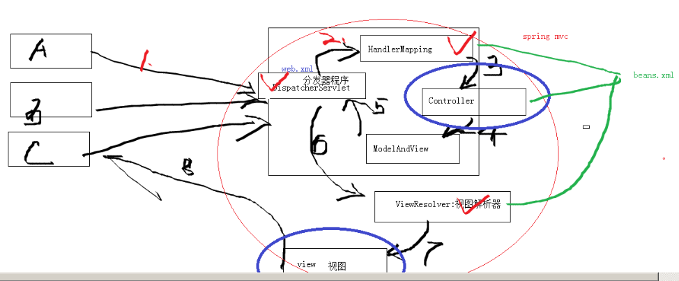
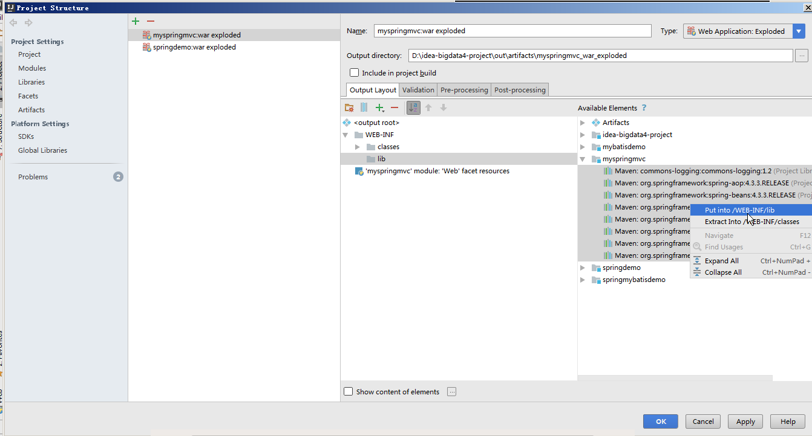
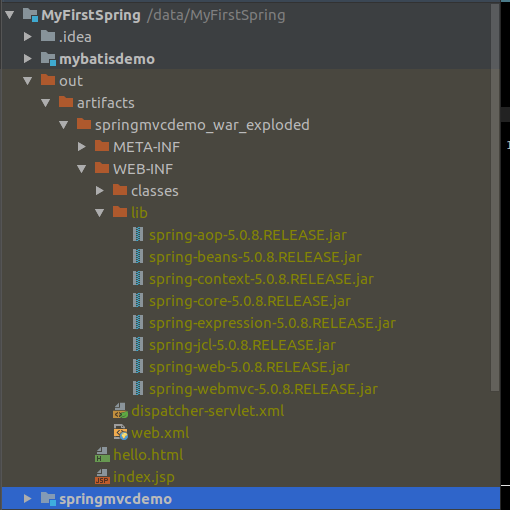

title = "2018-08-17"
weight = 100

------

# 20180822-Spring MVC

## REST(Representational State Transfer)

## 1. 新建web模块

1. file--> new--> module --> additional Libraries add Frameworks --> `Java EE(Web Application)` -- ok;
2. add Framework Support --> maven;
3. Run--->edit configuration-->Tomcat server-->deployment选项卡 -> `+ ` --> artifact --> tomcat_name war exploded.

## 2. IDEA--Tomcat 热部署


1. 关闭Tomcat；

2. Run-->edit configurations--Server选项卡--> VM options部分

   on "Update" action: 选择update Classes and resources

   on Frame deactivation: 选择update Classes and resources

## 3. Spring-MVC结构



其中，　划`对勾`的已实现，只需要配置即可；我们需要做的是实现`蓝色椭圆`部分．

## 4. 依赖
核心依赖: `spring-webmvc`

## 5. 按照Spring-MVC结构图开始配置
### 5.1 配置 DispatcherServlet
1. 配置文件[web/WEB-INF/web.xml]

   [web.xml]]
```
<?xml version="1.0" encoding="UTF-8"?>
<web-app xmlns="http://xmlns.jcp.org/xml/ns/javaee"
         xmlns:xsi="http://www.w3.org/2001/XMLSchema-instance"
         xsi:schemaLocation="http://xmlns.jcp.org/xml/ns/javaee http://xmlns.jcp.org/xml/ns/javaee/web-app_4_0.xsd"
         version="4.0">
    <!-- 配置分发器DispatcherServlet,  -->
    <servlet>
        <servlet-name>dispactherServlet</servlet-name>
        <servlet-class>org.springframework.web.servlet.DispatcherServlet</servlet-class>
    </servlet>
    <servlet-mapping>
        <servlet-name>dispactherServlet</servlet-name>
        <url-pattern>/</url-pattern>
    </servlet-mapping>
</web-app>
```
### 5.2 配置 HandlerMapping

0. 文件位置[web/WEB-INF/dispatcher-servlet.xml],　

    文件名格式: `dispatcher_servlet_name-servlet.xml`, 前半部分为：DispatcherServlet的servlet-name．如: `dispatcher-servlet.xml`;

1. `DefaultAnnotationHandlerMapping`, 将请求映射给使用`@RequestMapping`注解的控制器和控制器方法．通过:

   `<mvc:annotation-driven />`注解驱动配置`DefaultAnnotationHandlerMapping`．

   [dispatcher-servlet.xml]]

   ```
   <?xml version="1.0" encoding="UTF-8"?>
   <beans xmlns="http://www.springframework.org/schema/beans"
          xmlns:xsi="http://www.w3.org/2001/XMLSchema-instance"
          xmlns:mvc="http://www.springframework.org/schema/mvc"
          xsi:schemaLocation="
          http://www.springframework.org/schema/beans
          http://www.springframework.org/schema/beans/spring-beans.xsd
          http://www.springframework.org/schema/mvc
          http://www.springframework.org/schema/mvc/spring-mvc-4.3.xsd">
   
       <mvc:annotation-driven/>
   
   </beans>
   ```

   ### 5.3 编写Controller类

   ```
   @Controller
   public class HomeController {
       @RequestMapping(value = "/")
       public String goHome() {
           System.out.println("Hello Spring MVC!!");
           return "Hello Spring MVC";
       }
   }
   
   ```

   ### 5.4 配置Spring包扫描路径

   1. 作用

      为使编写的Controller可以被容器管理，需要配置其所在包的路径在Spring的扫描路径中．

   2. 配置

   [dispatcher-servlet.xml]

   ```
   <?xml version="1.0" encoding="UTF-8"?>
   <beans xmlns="http://www.springframework.org/schema/beans"
          xmlns:xsi="http://www.w3.org/2001/XMLSchema-instance"
          xmlns:mvc="http://www.springframework.org/schema/mvc"
          xmlns:context="http://www.springframework.org/schema/context"
          xsi:schemaLocation="
                   http://www.springframework.org/schema/beans
                   http://www.springframework.org/schema/beans/spring-beans.xsd
                   http://www.springframework.org/schema/mvc
                   http://www.springframework.org/schema/mvc/spring-mvc-4.3.xsd
                   http://www.springframework.org/schema/context
                   http://www.springframework.org/schema/context/spring-context-3.0.xsd
          ">
   
       <!--　配置注解驱动　-->
       <mvc:annotation-driven/>
   
       <!-- 配置包扫描路径 -->
       <context:component-scan base-package="com.huh.springmvcdemo.controller"/>
   
   </beans>
   ```

   ### 5.5 启动

   目的查看浏览器的访问是否可以通过控制器(@Controller)传递到被＠RequestMapping注解的方法．

   1. 解决`DispatcherServlet类找不到异常`: 需要将项目的类库放到`WEB-INF/lib/`下，操作如下图:

   

   2. 放置完成效果如下：

   

   3. 再次启动，访问`http://localhost:8080/home`, 查看控制台是否输出`HomeController中打印的`"Hello Spring MVC!!"．

### 5.6 配置InternalResourceViewResolver视图解析器
1. 作用
    配置视图解析器, 即：　被＠RequestMapping注解的方法返回一个字符串，
    如："aaa", 视图解析器将　'prefix' + 'aaa' + suffix 连接在一起.
    最终得到一个jsp页面的名称

2. 配置
［dispatcher-servlet.xml］

```
<?xml version="1.0" encoding="UTF-8"?>
<beans xmlns="http://www.springframework.org/schema/beans"
       xmlns:xsi="http://www.w3.org/2001/XMLSchema-instance"
       xmlns:mvc="http://www.springframework.org/schema/mvc"
       xmlns:context="http://www.springframework.org/schema/context"
       xsi:schemaLocation="
                http://www.springframework.org/schema/beans
                http://www.springframework.org/schema/beans/spring-beans.xsd
                http://www.springframework.org/schema/mvc
                http://www.springframework.org/schema/mvc/spring-mvc-4.3.xsd
                http://www.springframework.org/schema/context
                http://www.springframework.org/schema/context/spring-context-3.0.xsd
       ">

    <!--　配置注解驱动　-->
    <mvc:annotation-driven/>

    <!-- 配置包扫描路径 -->
    <context:component-scan base-package="com.huh.springmvcdemo.controller"/>

    <!--配置视图解析器, 即：　被＠RequestMapping注解的方法返回一个字符串，
    如："aaa", 视图解析器将　'prefix' + 'aaa' + suffix 连接在一起.
    最终得到一个jsp页面的名称：　/aaa.jsp-->
    <bean class="org.springframework.web.servlet.view.InternalResourceViewResolver">
        <!--　/aaa.jsp　-->
        <property name="prefix" value="/" />
        <property name="suffix" value=".jsp"/>
    </bean>

</beans>
```

### 5.7 修改Controller

1. 作用

   使之返回一个字符串，配合视图解析器，得到一个jsp的文件名称．

2. 修改

```
@Controller
public class HomeController {
    @RequestMapping(value = "/home")
    public String goHome() {
        System.out.println("Hello Spring MVC!!");
        return "index";　　// 视图解析器将解析到：　index.jsp页面
    }
}
```

### 5.8 再次启动

访问： http://locahost:8080/home 查看是否进入index.jsp

### 5.9 模拟用户注册

1. 创建表单注册页面

   [reg.jsp]

   ```
   <%@ page contentType="text/html;charset=UTF-8" language="java" %>
   <!DOCTYPE html>
   <html lang="en">
   <head>
       <meta charset="UTF-8">
       <title>注册</title>
   </head>
   <body>
   <form id="reg_form" name="reg_form">
       用户名：<input type="text" id="username" name="username"/> <br />
       密码：　<input type="password" id="password" name="password"/> <br />
       <input type="submit" name="submit" value="注册">
   </form>
   </body>
   </html>
   ```

2. 创建RegisterController．
  ［RegisterController.java］

  ```
  
  ```

  

