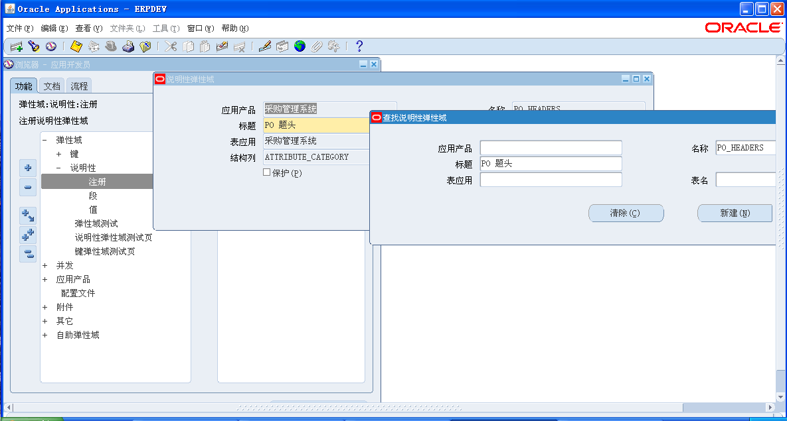
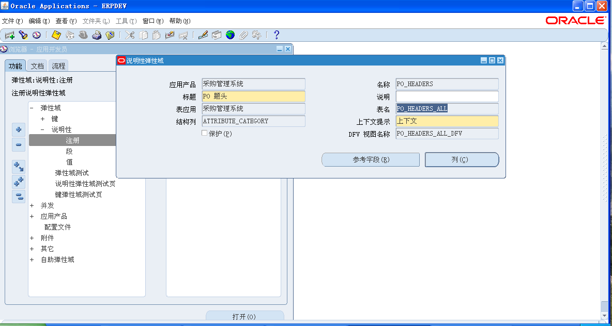
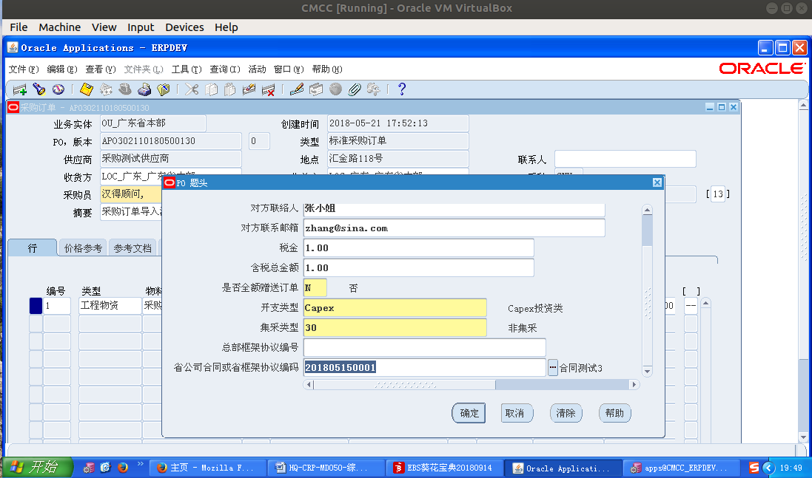
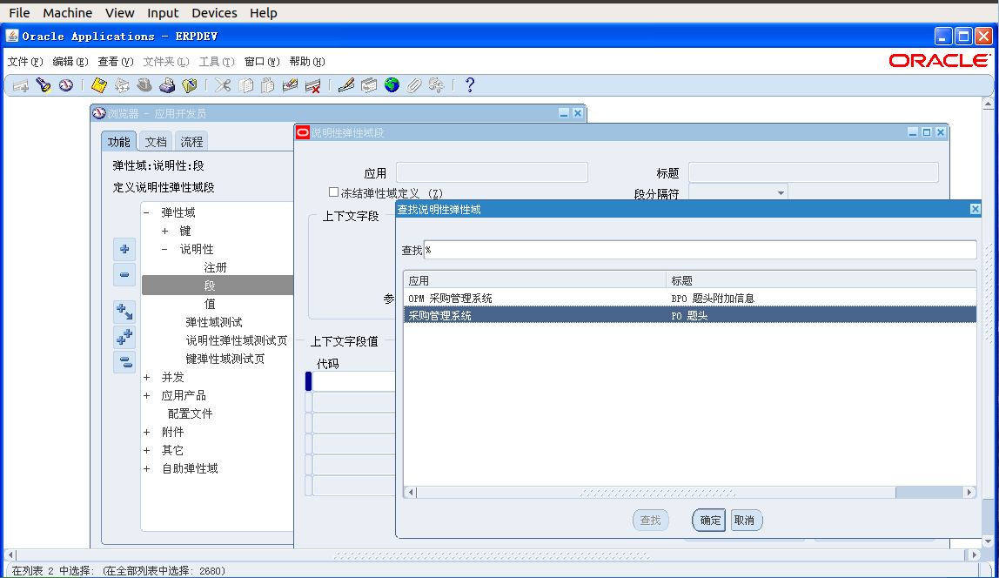
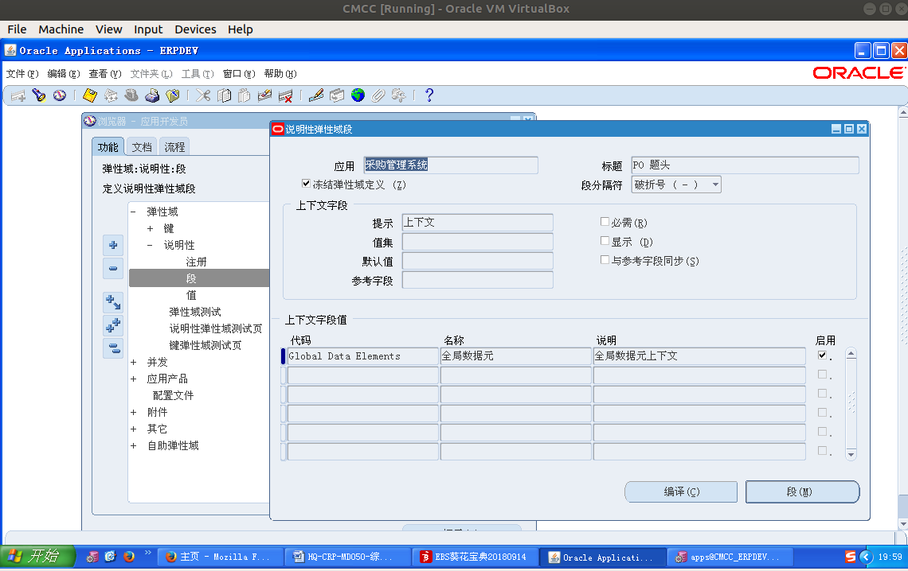
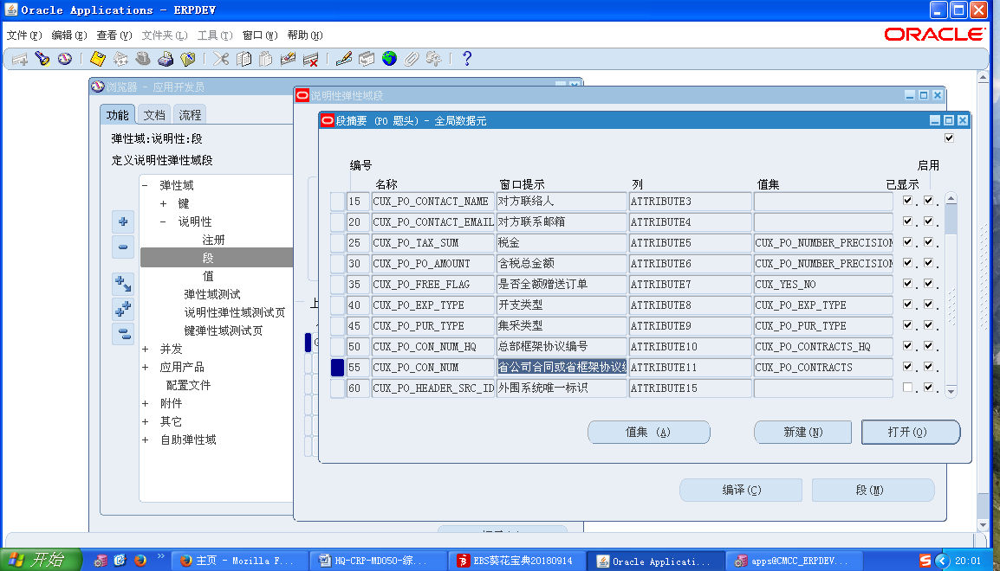
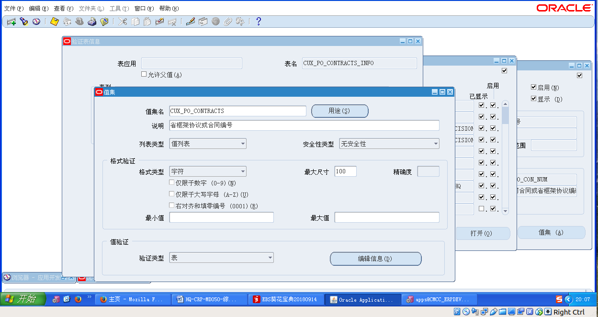
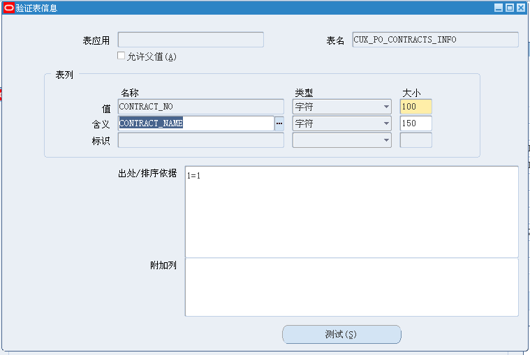

# 查找说明性弹性域字段

## 1. 查找"注册"，即题头对应的表

### 1.1 明确标题

标题：　"PO 题头"



### 1.2 得到表头对应的表名




## 2．查找"段"，即要查询的字段和对应的表

### ２.1 明确标题和要查找的字段　

标题：　"PO 题头"

字段：＂省公司合同或省框架协议编码＂



### 2.2 查找标题 

查找标题＂PO　题头＂



### 2.3 点击字段名及所在表

1. 点击"段"(两次点击)



2. 看到如下界面，界面中有要找的字段，和对应在某表中的字段名(第三列)，　即：`attribute11`为头表"PO_HEADERS_ALL"中要用来关联的字段．



3. 点击"打开"　-- > 点击"值集" --> 点击"编辑信息"，得到该字段名所在的表：　==>  "CUX_PO_CONTRACTS_INFO"



4. 具体表名及表中一些字段



5. 结论, 要查找的表为：`CUX_PO_CONTRACTS_INFO`, 字段: `contract_no`


## ３．关联两表，得到所要字段
```
SELECT cpci.contract_no,  -- 合同编号
       cpci.contract_name　　　-- 合同名称
  FROM cux_po_contracts_info cpci,
       po_headers_all        poha
 WHERE poha.attribute11 = cpci.contract_no
   AND poha.po_header_id = 5283
```