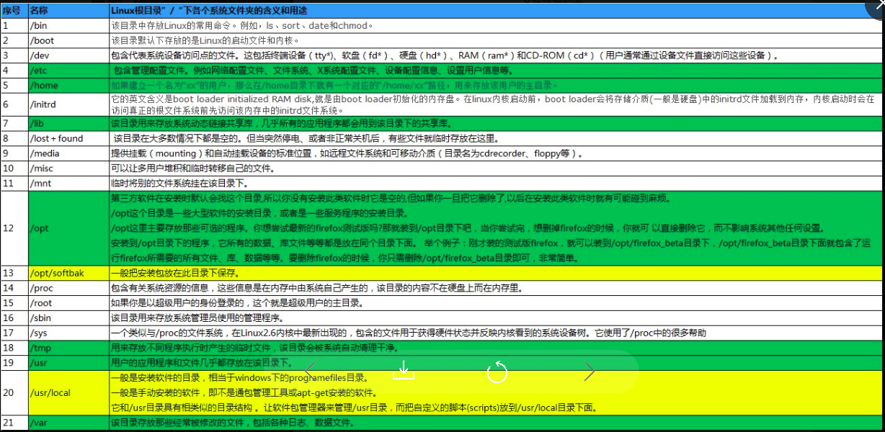

### 0. 自带目录

### 1.jsch

`jsch`是JAVA的SSH客户端，使用的目的是执行远程服务器上的命令.

### 2.FQDN 

 fully qualified domain name (FQDN) 完全限定域名，通过`$ hostname -f`查看．

### 3. /opt目录

一般安装浏览器等应用级别的软件．

### 4. 环境变量

建议正式环境下，将环境变量做到一个可执行文件里，配置开机自执行．避免服务器被攻击时一些敏感的命令被执行．

### 5. [NTP](https://baike.baidu.com/item/NTP/1100433)

1. 介绍：

   NTP是网络时间协议(Network Time Protocol)，它是用来同步网络中各个计算机的时间的协议。其精度在局域网内可达0.1ms，在互联网上绝大多数的地方其精度可以达到1-50ms。

2. 安装并启动:

> RHEL/centos/oracle6:`yum install -y ntp chkconfig ntpd on`
>
> RHEL/centos/oracle7: `yum install -y ntp systemctl enable ntpd`
>
> Debian/ubuntu:`apt-get install ntp update-rc.d ntp defaults`

### 6.[NSCD](https://www.jianshu.com/p/a0a81062cdb4)

1. 介绍：

   nscd（Name Service Cache Daemon）是一种能够缓存 passwd、group、hosts 的本地缓存服务，分别对应三个源 `/etc/passwd`、`/etc/hosts`、`/etc/resolv.conf`。其最为明显的作用就是加快 DNS 解析速度，在接口调用频繁的内网环境建议开启.

2. 作用：

   开启 nscd 的 hosts 缓存服务后，每次内部接口请求不会都发起 dns 解析请求，而是直接命中 nscd 缓存散列表，从而获取对应服务器 ip 地址，这样可以在大量内部接口请求时减少接口的响应时间。

3. 安装：

   

 

 

 