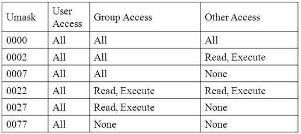
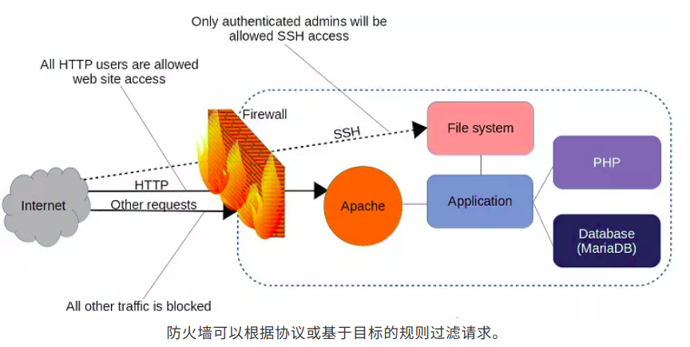
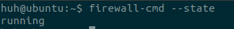
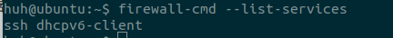
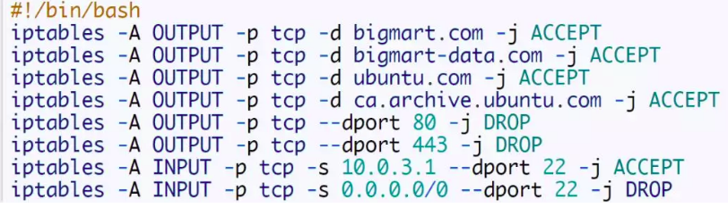
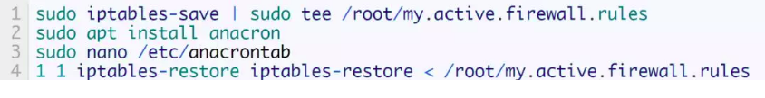

## 1.小工具

### 1. gedit
* 配置gedit加载时自动识别文件编码方式，默认为utf-8 <br/>
`$ gsettings set org.gnome.gedit.preferences.encodings candidate-encodings "['GB18030', 'UTF-8', 'CURRENT', 'ISO-8859-15', 'UTF-16']"`

### 2. cut
作用:按列提取文本  <br />
语法:`$ cut -f field_list file_name`  <br />
-d: 指定分隔符 `-d ' '`  <br />
-f: 按字段提取. 字段列表, 通常用数字代替字段序号.通常有4种方式: a. `-f num1,num2`; b. `-f num1-num2`; c. `-num1`; d. `num1-`  <br />
-c: 按字符提取. 通常有4种方式: a. `-c num1,num2`; b. `-c num1-num2`; c. `-num1`; d. `num1-`  <br />
-b: 按字节提取. 通常有4种方式: a. `-b num1,num2`; b. `-b num1-num2`; c. `-num1`; d. `num1-` <br />
注1: -c和-b提取多字段时应指定输出分隔符 --output-delimiter '分隔符'. <br />
注2: ** 采用方式a时, num1,num2之间无空格.<br /> **
注3: `-num1`表示[1, num1], `num1-`表示[num1, 正无穷]

usage:
* `$ cut -f 1-3 -d ' ' test.txt`
```
Id Name Mark
1 Sarath 45
2 Alex 49
3 Anu 45
```

* `$cut -f 1,3 -d ' ' test.txt`
```
Id Mark
1 45
2 49
3 45
```

* `$ cut test -c1-3,5-9   --output-delimiter ','`
```
Id ,ame M
1 S,rath
2 A,ex 49
3 A,u 45
```

### 3. diff
作用: 比较两个文件的不同(支持目录比较), line by line. <br />
语法: `diff [option] file1 file2` <br />
usage: `$ diff text1 text2` <br />
注: 末尾加`-y`参数, 表示并列展示文件的不同之处. `$ diff test1 test2 -y`  <br />
输出说明:
```
"|"表示前后2个文件内容有不同
"<"表示后面文件比前面文件少了1行内容
">"表示后面文件比前面文件多了1行内容
```

### 4. Linux内存检查
top
free
vmstat
dmidecode
`/proc/meminfo 文件`

### 5. pbcopy & pbpaste

0. 作用: 命令行快速剪切,粘贴

1. 安装xclip, xsel(linux不支持pbcopy, pbpaste)

```
$ sudo apt-get install xclip
$ sudo apt-get install xsel
```

2. 修改`~/.bashrc`, 添加如下:

```
// xclip
alias pbcopy='xclip -selection clipboard'
alias pbpaste='xclip selection clipboard -o'

// xsel
alias pbcopy='xsel --clipboard --input'
alias pbpaste='xsel --clipboard --output'
```
3. 生效

`$source ~/.baashrc`

4. usage:
   1. `$ echo "Hello" | pbcopy`

      `$pbpaste`  ==> Hello

   2. `pbcopy < xx.txt`

      `pbpaste` ==> 文件内容

### 6.  进程查看

1. jps, 查看jvm进程, 属于jdk自带工具;

2. ps,  **  report a snapshot of the current processes **

   > BSD风格: `$ ps aux`, 列出所有进程(a,x)及用户(u);
   >
   > Unix风格: `$ ps -elf`, 列出所有进程(-e,) -待办完整格式;
   >
   > 一种错误的格式: `$ ps -aux`, 表示列出用户x的所有进程, 没有则报错.


### 7. scp

```
拷贝远程主机的文件(在A服务器上操作，将B服务器上/home/lk/目录下所有的文件全部复制到本地的/root目录下)
$scp -r root@43.224.34.73:/home/lk /root
```

```
拷贝本地文件到远程主机：
`$scp -r ncdc/ luxinxin@10.211.114.198:~/Downloads/`
```

### 8. netstat


### 9. tcpdump

### 10. ufw

`$ sudo apt-get install ufw`
`$ sudo ufw status`
`$ sudo ufw enable`
`$ sudo ufw disable`
`$ ufw default allow/deny` :外来访问默认允许/拒绝
`$ufw allow/deny 20`：允许/拒绝 访问20端口,20后可跟/tcp或/udp，表示tcp或udp封包。
`$ ufw allow/deny servicename`  ：ufw从/etc/services中找到对应service的端口，进行过滤。
`$ ufw allow proto tcp from 10.0.1.0/10 to 本机ip port 25`  :允许自10.0.1.0/10的tcp封包访问本机的25端口。
`$ ufw delete allow/deny 20`  :删除以前定义的"允许/拒绝访问20端口"的规则

### 11. Ubuntu测网速工具

`$ speedtest-cli`

### 12. ubuntu设置代理上网

1. 确定一个代理地址: `http://proxy.cmcc:8080`

2. 修改.bashrc文件，或直接进入"设置"--> "Network" --> "Network Proxy"添加代理即可．(二者选其一，建议后者).

   如下:

   

   或者

   

### 13. umask

介绍：

> 作用:  **umask命令**用来设置限制新建文件权限的掩码(八进制); 当新文件被创建时，其最初的权限由文件创建掩码决定;
>
> 原理: 用户每次注册进入系统时，umask命令都被执行， 并自动设置掩码mode来限制新文件的权限;
>
> 使用: 用户可以通过再次执行umask命令来改变默认值，新的权限将会把旧的覆盖掉;
>
> 默认值: `0022`

usage1：

>`$umask u=, g=w, o=rwx` , 使用此命令创建掩码，使得组用户的写权限，其他用户的读、写和执行权限都被取消．

usage2：



usage3:

> 若要经常修改其值，可以将其写进环境变量中: `~/.bashrc`或`/etc/profile`或`~/.bash_profile`

### 14. useradd和adduser

1. CentOS下`useradd`与`adduser`是没有区别的都是在创建用户，在home下自动创建目录，没有设置密码，需要使用passwd命令修改密码;

2. 在Ubuntu下useradd与adduser有所不同

   1)、`useradd`在使用该命令创建用户是不会在/home下自动创建与用户名同名的用户目录，而且不会自动选择shell版本，也没有设置密码，那么这个用户是不能登录的，需要使用passwd命令修改密码;

   2)、`adduser`在使用该命令创建用户是会在/home下自动创建与用户名同名的用户目录，系统shell版本，会在创建时会提示输入密码，更加友好。

### 15. userdel和deluser

### 16. tee
tee命令，用于从标准输入设备读取数据，并将其内容`输出成`或`输出到`文件。
语法： `tee -ai --version [文件]`
参数说明：
	-a　追加
	-i	忽略中断信号
实例：
	`$ tee -a -i test1`
	`$ tee test2 test3`  --> 同时将输入数据写入到test2和test3两个文件．


## 2. 网络

### 1. 防火墙

 (部分摘自微信公众号：LCTT  Linux爱好者)

1. 概念: 防火墙是一组规则。当数据包进出受保护的网络区域时，进出内容（特别是关于其来源、目标和使用的协议等信息）会根据防火墙规则进行检测，以确定是否允许其通过.

2. 图示:

   

3. 管理防火墙规则的工具

   | 工具名    | 作用描述                                                     | 备注                                                         |
   | --------- | ------------------------------------------------------------ | ------------------------------------------------------------ |
   | iptables  | 构建全方面的网络解决方案通常需要 iptables，<br />或者它的替代品 --> nftables (nft 命令行工具) | Linux 管理防火墙规则的工具                                   |
   | firewalld | firewalld 主要是为解决`单独的计算机`所面临的各种问题而设计   | Linux 管理防火墙规则的工具<br />redhat和centos默认安装，<br/>也可以在debain系上使用． |
   | nftables  |                                                              |                                                              |
   | ufw       | ufw 主要是为解决`单独的计算机`所面临的各种问题而设计的       |                                                              |

4. firewalld 的使用(`firewall-cmd` 工具从命令行操作 )

   1). 返回当前防火墙的状态: `$ firewall-cmd --state`．默认情况下，firewalld 处于运行状态，并拒绝所有传入流量，但有几个例外，如 SSH．  <br/>

   　　　　　　　　　　　　　

   

   2). 查看当前防火墙设置: `firewall-cmd --list-services`．可以看到，默认只有SSH和dhcpv6-client可以传入流量

   

   

   3).  web 服务器的要求希望打开 HTTP 和 HTTPS 端口(按照惯例，这两个端口分别被指定为` 80` 和 `443`)

   `$ firewall-cmd --permanent --add-port=80/tcp`  
   `$ firewall-cmd --permanent --add-port=443/tcp` 

   参数：　

   --permanent　: 它告诉 firewalld 在每次服务器启动

   –add-port  　  : 该参数直接引用端口号及其将使用的网络协议

   

   4). 将上述配置应用于当前会话

   `$ firewall-cmd --reload`

5. 案例－－书店书籍查询终端
   1). 需求：
   1. 允许终端登录到 BigMart.com 产品页面，允许查找商品特征、过道位置和库存水平;
   2. 允许终端进入 bigmart-data.com;
   3. 允许下载软件包更新;
   4. 允许从本地工作站访问 SSH.

   

   2).  配置
   　

   　3). 配置说明
   注意1：规则顺序是很重要。因为 iptables 会对一个请求遍历每个规则，直到遇到匹配的规则。
   注意2：机器的 IP 发生变化，请提前更新这个规则；否则，你会被拒绝访问。
   注意3：当前的配置方式，只需重启服务器，iptables 规则就会全部丢失。

| 选项    | 选项描述                         | 参数值        | 参数值描述                             |
| ------- | -------------------------------- | ------------- | -------------------------------------- |
| `-A`    | 它告诉 iptables ，要添加规则;    | ` OUTPUT`     | 要添加的这条规则应该成为输出链的一部分 |
| `-p `   | 表示该规则仅                     | tcp           | 使用 TCP 协议的数据包                  |
| -d      | 目的地址                         | bigmart.com   | 目的地址是 bigmart.com                 |
| -j      | 当数据包符合规则时要采取何种操作 | ACCEPT / DROP | 接受/丢弃                              |
| -s      |                                  |               |                                        |
| --dport |                                  |               |                                        |
第1-第6条规则：只允许该终端向` BigMarｔ`和` Ubuntu` 发送 HTTP 和 HTTPS 请求，而不允许向其他目的地发送．
最后两条规则解析：　允许来自`10.0.3.1:22`的请求, 拒绝其他任何来自 `ip:22` 的请求．

4). 测试
`$ curl baidu.com`
`$ curl bigmart-data.com`

5). 配置系统启动时自动加载规则

需要解决的问题：
1. 规则文件的保存 --> 使用`iptables-save`规则文件保存到根目录;
2. 关机后定时任务依然有效(会被记录，开机时会执行)，不能使用`cron`; --> anacron；
3. 规则文件定时加载 --> iptables-restore,　且需要指定规则文件的路径．

思路：
1.  使用`iptables-save`工具保存iptables规则文件，会在根目录创建创建一个包含规则列表的文件`/root/my.actice.firewall.rules`；
2.  使用`anacron`做定时任务，该工具需要安装．系统每次启动时运行`iptables-restore` ，将在 /etc/ 目录中为我们提供一个名为 anacrontab 的文件`/etc/anacrontab`, `iptables-restore`命令需要添加进这个文件以定时执行．

做法：




