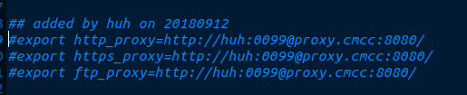
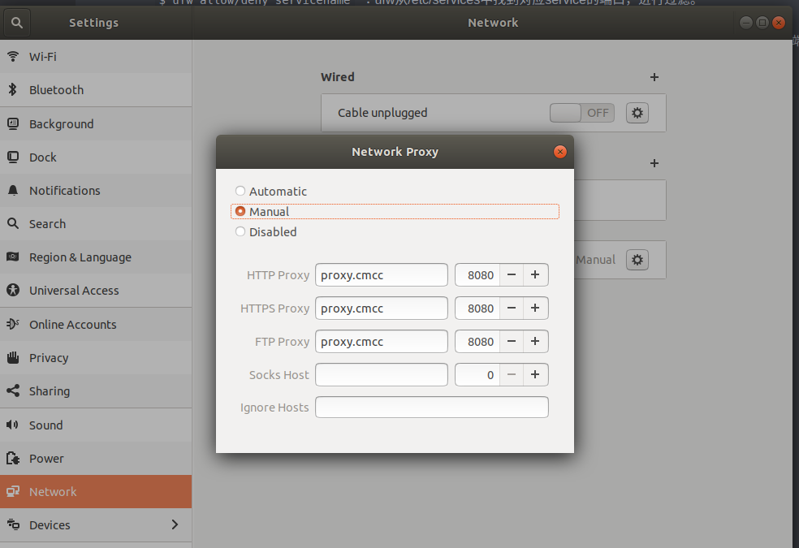

# 小工具

## 1. gedit
* 配置gedit加载时自动识别文件编码方式，默认为utf-8 <br/>
`$ gsettings set org.gnome.gedit.preferences.encodings candidate-encodings "['GB18030', 'UTF-8', 'CURRENT', 'ISO-8859-15', 'UTF-16']"`

## 2. cut
作用:按列提取文本  <br />
语法:`$ cut -f field_list file_name`  <br />
-d: 指定分隔符 `-d ' '`  <br />
-f: 按字段提取. 字段列表, 通常用数字代替字段序号.通常有4种方式: a. `-f num1,num2`; b. `-f num1-num2`; c. `-num1`; d. `num1-`  <br />
-c: 按字符提取. 通常有4种方式: a. `-c num1,num2`; b. `-c num1-num2`; c. `-num1`; d. `num1-`  <br />
-b: 按字节提取. 通常有4种方式: a. `-b num1,num2`; b. `-b num1-num2`; c. `-num1`; d. `num1-` <br />
注1: -c和-b提取多字段时应指定输出分隔符 --output-delimiter '分隔符'. <br />
注2: ** 采用方式a时, num1,num2之间无空格.<br /> **
注3: `-num1`表示[1, num1], `num1-`表示[num1, 正无穷]

usage:
* `$ cut -f 1-3 -d ' ' test.txt`
```
Id Name Mark
1 Sarath 45
2 Alex 49
3 Anu 45
```

* `$cut -f 1,3 -d ' ' test.txt`
```
Id Mark
1 45
2 49
3 45
```

* `$ cut test -c1-3,5-9   --output-delimiter ','`
```
Id ,ame M
1 S,rath
2 A,ex 49
3 A,u 45
```

## 3. diff
作用: 比较两个文件的不同(支持目录比较), line by line. <br />
语法: `diff [option] file1 file2` <br />
usage: `$ diff text1 text2` <br />
注: 末尾加`-y`参数, 表示并列展示文件的不同之处. `$ diff test1 test2 -y`  <br />
输出说明:
```
"|"表示前后2个文件内容有不同
"<"表示后面文件比前面文件少了1行内容
">"表示后面文件比前面文件多了1行内容
```

## 4. Linux内存检查
top
free
vmstat
dmidecode
`/proc/meminfo 文件`

## 5. pbcopy & pbpaste

0. 作用: 命令行快速剪切,粘贴

1. 安装xclip, xsel(linux不支持pbcopy, pbpaste)

```
$ sudo apt-get install xclip
$ sudo apt-get install xsel
```

2. 修改`~/.bashrc`, 添加如下:

```
// xclip
alias pbcopy='xclip -selection clipboard'
alias pbpaste='xclip selection clipboard -o'

// xsel
alias pbcopy='xsel --clipboard --input'
alias pbpaste='xsel --clipboard --output'
```
3. 生效

`$source ~/.baashrc`

4. usage:
   1. `$ echo "Hello" | pbcopy`

      `$pbpaste`  ==> Hello

   2. `pbcopy < xx.txt`

      `pbpaste` ==> 文件内容

## 6.  进程查看

1. jps, 查看jvm进程, 属于jdk自带工具;

2. ps,  **  report a snapshot of the current processes **

   > BSD风格: `$ ps aux`, 列出所有进程(a,x)及用户(u);
   >
   > Unix风格: `$ ps -elf`, 列出所有进程(-e,) -待办完整格式;
   >
   > 一种错误的格式: `$ ps -aux`, 表示列出用户x的所有进程, 没有则报错.


## 7. scp

```
拷贝远程主机的文件(在A服务器上操作，将B服务器上/home/lk/目录下所有的文件全部复制到本地的/root目录下)
$scp -r root@43.224.34.73:/home/lk /root
```

```
拷贝本地文件到远程主机：
`$scp -r ncdc/ luxinxin@10.211.114.198:~/Downloads/`
```

## 8. netstat


## 9. tcpdump

## 10. ufw

`$ sudo apt-get install ufw`

`$ sudo ufw status`

`$ sudo ufw enable`

`$ sudo ufw disable`

`$ ufw default allow/deny` :外来访问默认允许/拒绝

`$ufw allow/deny 20`：允许/拒绝 访问20端口,20后可跟/tcp或/udp，表示tcp或udp封包。

`$ ufw allow/deny servicename`  ：ufw从/etc/services中找到对应service的端口，进行过滤。

`$ ufw allow proto tcp from 10.0.1.0/10 to 本机ip port 25`  :允许自10.0.1.0/10的tcp封包访问本机的25端口。

`$ ufw delete allow/deny 20`  :删除以前定义的"允许/拒绝访问20端口"的规则

## 11. Ubuntu测网速工具

`$ speedtest-cli`

## 12. ubuntu设置代理上网

1. 确定一个代理地址: `http://proxy.cmcc:8080`

2. 修改.bashrc文件，或直接进入"设置"--> "Network" --> "Network Proxy"添加代理即可．(二者选其一，建议后者).

   如下:

   

   或者

   