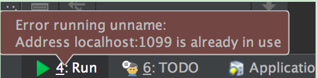

# IDEA

## 1. 快捷键
* 快速查找类 -->  `Ctrl+Shift+Alt+N`
* getter/setter  ---> `Alt + insert`
* 多行编辑  -->  `Alt + shift` + 鼠标选择
* implement method  --> Alt + shift + p
* 输入文件名查找文件--> Ctrl+Shift+R
* 全局查找文件内容　--> Ctrl + H

## 2. jetbrains 全系破解

[全系破解](https://blog.csdn.net/active_it/article/details/80669423)


## 3. 端口占用

ssm整合过程中，启动tomcat出现1099端口占用，如下图:



[解决方法](https://stackoverflow.com/questions/38986910/intellij-idea-address-localhost1099-is-already-in-use)

```
$ ps -C java -o pid
$ pkill java
```

